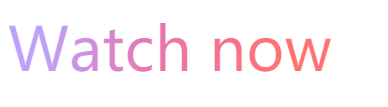

## CSS3 属性

- ## text-fill-color : color;
  - 文字填充颜色
  - 注： `text-fill-color` 和 `color` 一起使用 那么 `color` 不会起作用
- ## text-stroke: width color;

  - 文字描边

- ## box-decoration-break: slice/clone;

  - 在 CSS 布局中，总会存在元素 box 盒子断开的情况(page/column/region/line)
  - box-decoration-break 可以决定断开时渲染的表现
    - slice 切片、分割的意思，默认值。表示盒子断开部分如同切割一般
    - clone 克隆、独立的意思，表示断开的各个盒子样式独自渲染

<br/><br/>

> ## 文字镂空效果

<br/>


```html
<style>
  body {
    background-color: #000;
  }

  a {
    font-size: 60px;
    -webkit-text-fill-color: transparent;
    -webkit-text-stroke: 1px #fff;
  }
</style>
<body>
  <a>Watch now</a>
</body>
```

<br/><br/>

> ## 文字渐变色

<br/>



```html
<style>
  a {
    font-size: 60px;
    background: linear-gradient(
      92.05deg,
      #bca1f7 12.09%,
      #e577b4 42.58%,
      #ff7170 84.96%
    );
    -webkit-background-clip: text;
    -webkit-text-fill-color: transparent;
    -webkit-box-decoration-break: clone;
  }
</style>
<body>
  <a href="#"> Watch now </a>
</body>
```

- background-clip 必须放在 background 后面不然不起作用
- background-clip: text 会将背景作为文字区域裁剪。

<br/><br/>

> ## 元素片段跨行、跨列渲染表现

<br/>


<br/>


```html
<style>
  .box {
    width: 200px;
    color: #fff;
  }
  .text {
    border-radius: 30px;
    background-color: #cd0000;
    /* 区别在这 */
    -webkit-box-decoration-break: clone;
  }
</style>

<div class="box">
  <span class="text">这段文字将被折断.这段文字将被折断</span>
</div>
```

<br/><br/>

> ## 参见

<br/>

- [css text-fill-color 与 text-stroke 讲解](https://www.cnblogs.com/pssp/p/5908397.html)
- [css box-decoration-break 属性简介](https://www.zhangxinxu.com/wordpress/2019/01/css-css3-box-decoration-break/?shrink=1)
