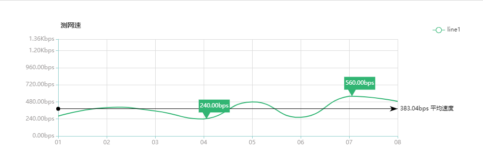
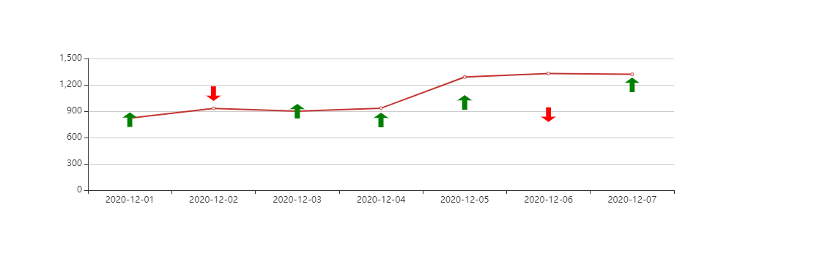

# 自定义 markPoint 样式 平均线

## 两种自定义标记

在 echarts 中 markPoint 的样式内置了 ‘circle’, ‘rect’, ‘roundRect’, ‘triangle’, ‘diamond’, ‘pin’, ‘arrow’ 几种，如果这些都不太符合需要就必须自定义我们需要的样式。

自定义标记的图形有两种方式：

1. 通过 ‘image://url’ 设置为图片，其中 URL 为图片的链接，或者 dataURI。
2. 通过 ‘path://’ 将图标设置为任意的矢量路径。这种方式相比于使用图片的方式，不用担心因为缩放而产生锯齿或模糊，而且可以设置为任意颜色。路径图形会自适应调整为合适的大小。

- [SVG Path 介绍](https://www.w3school.com.cn/svg/svg_path.asp)

## echarts 的 path://

- 在 echarts 上使用 path 只需把 <font color=yellow bgcolor=orange>path</font> 标签上的指令写在 <font color=yellow bgcolor=orange>path://</font> 之后

---

<br/><br/><br/>

## 代码入戏



```html
<!DOCTYPE html>
<html style="height: 100%">
  <head>
    <meta charset="utf-8" />
  </head>
  <body style="height: 100%; margin: 0">
    <div id="container" style="height: 300px;width:1000px;padding: 20px;"></div>
    <script
      type="text/javascript"
      src="https://cdn.jsdelivr.net/npm/echarts/dist/echarts.min.js"
    ></script>
    <script
      type="text/javascript"
      src="https://cdn.jsdelivr.net/npm/echarts-gl/dist/echarts-gl.min.js"
    ></script>
    <script
      type="text/javascript"
      src="https://cdn.jsdelivr.net/npm/echarts-stat/dist/ecStat.min.js"
    ></script>
    <script
      type="text/javascript"
      src="https://cdn.jsdelivr.net/npm/echarts/dist/extension/dataTool.min.js"
    ></script>
    <script
      type="text/javascript"
      src="https://cdn.jsdelivr.net/npm/echarts/map/js/china.js"
    ></script>
    <script
      type="text/javascript"
      src="https://cdn.jsdelivr.net/npm/echarts/map/js/world.js"
    ></script>
    <script
      type="text/javascript"
      src="https://api.map.baidu.com/api?v=2.0&ak=0E6a4c10c8321b644433e42c7bb27f10f"
    ></script>
    <script
      type="text/javascript"
      src="https://cdn.jsdelivr.net/npm/echarts/dist/extension/bmap.min.js"
    ></script>
    <script type="text/javascript">
      var myChart = echarts.init(document.getElementById("container"));
      var option = {
        title: {
          text: "测网速",
          top: 20,
          left: "10%",
          textStyle: {
            fontSize: 14,
            fontWeight: 600,
          },
        },
        legend: {
          data: ["line1"],
          top: 30,
          right: "6.5%",
          formatter: function (name) {
            return name;
          },
          itemGap: 40,
        },
        grid: {
          top: 60,
          left: "10%",
          right: "20%",
          bottom: 40,
        },
        tooltip: {
          trigger: "axis",
          formatter: function (data) {
            var html = "";
            if (data.componentType == "markPoint") {
              html = data.seriesName;
            } else {
              html = data[0].name;
              for (var i = 0; i < data.length; i++) {
                var now = data[i];
                html +=
                  '</br><span style="display:inline-block;margin-right:5px;border-radius:10px;width:9px;height:9px;background-color:' +
                  now.color +
                  '"></span>' +
                  now.seriesName +
                  ": " +
                  toHSpeed(now.data, 2);
              }
            }
            return html;
          },
        },
        xAxis: [
          {
            type: "category",
            boundaryGap: false,
            axisTick: {
              alignWithLabel: false,
              interval: 0,
            },
            axisLine: {
              lineStyle: {
                color: "#8cccca",
              },
            },
            axisLabel: {
              textStyle: {
                color: "#a19e9e",
              },
              interval: 0,
              formatter: function (value, index) {
                return value;
              },
            },
            splitLine: {
              show: true,
              lineStyle: {
                color: "#dadada",
              },
            },
            data: ["01", "02", "03", "04", "05", "06", "07", "08"],
            axisPointer: {
              value: 2,
              type: "line",
              snap: true,
              lineStyle: {
                color: "red",
              },
              label: {
                margin: -520,
                color: "red",
                backgroundColor: "transparent",
              },
              triggerTooltip: false,
              handle: {
                show: true,
                icon: "image://http://image.com",
                size: [100, 100],
              },
            },
          },
        ],
        yAxis: [
          {
            type: "value",
            axisLine: {
              // y 线样式修改
              lineStyle: {
                color: "#8cccca",
              },
            },
            axisLabel: {
              // y 名称样式修改
              textStyle: {
                color: "#a19e9e",
              },
              formatter: function (data) {
                return toHSpeed(data, 2);
              },
            },
            splitLine: {
              // 取消y轴的网格
              show: true,
              lineStyle: {
                color: "#dadada",
              },
            },
            min: 0,
            max: function (value) {
              return value.max + 100;
            },
          },
        ],
        series: [
          {
            name: "line1",
            type: "line",
            color: ["#31b573"], // 颜色
            showSymbol: false,
            silent: true, // 取消点击事件
            smooth: true,
            itemStyle: {
              // 转折点 控制
              normal: {
                borderColor: "#277cdc",
              },
            },
            data: [35, 50, 44, 30, 60, 33, 70, 61],
            markPoint: {
              symbol: "path://m 0,0 h 48 v 20 h -30 l -6,10 l -6,-10 h -6 z", // 'circle', 'rect', 'roundRect', 'triangle', 'diamond', 'pin', 'arrow', path://m 0,0 h 48 v 20 h -30 l -6,10 l -6,-10 h -6 z,  path://m 0,0 h 48 v 20 h -34 l -6,10 l -6,-10 h -2 z
              symbolSize: function (val) {
                return [textSize(toHSpeed(val, 2), "12px").width + 5, 40];
              },
              symbolOffset: ["34%", "-50%"],
              symbolKeepAspect: true, // 如果 symbol 是 path:// 的形式，是否在缩放时保持该图形的长宽比。
              label: {
                position: "insideTop",
                distance: 7,
                formatter: function (data) {
                  return toHSpeed(data.value, 2);
                },
              },
              data: [
                {
                  type: "max",
                  name: "最大值",
                },
                {
                  type: "min",
                  name: "最小值",
                },
              ],
            },
            markLine: {
              itemStyle: {
                normal: {
                  lineStyle: {
                    type: "solid",
                    color: "#000",
                  },
                },
              },
              data: [
                {
                  type: "average",
                  name: "平均值",
                  label: {
                    formatter: function (params) {
                      return toHSpeed(params.value, 2) + " 平均速度";
                    },
                  },
                },
              ],
            },
          },
        ],
      };
      myChart.setOption(option, true);
      window.addEventListener("resize", function () {
        myChart.resize();
      });

      /**
       * 获取文本宽高
       * @param text       文本
       * @param fontSize   代表汉字的大小，英文字会自动按照默认值
       * @returns {{width: *, height: *}}
       */
      function textSize(text, fontSize) {
        var span = document.createElement("span");
        var result = {
          width: span.offsetWidth,
          height: span.offsetHeight,
        };
        span.style.visibility = "hidden";
        span.style.fontSize = fontSize || "14px";
        document.body.appendChild(span);

        if (typeof span.textContent != "undefined")
          span.textContent = text || "国";
        else span.innerText = text || "国";

        result.width = span.offsetWidth - result.width;
        result.height = span.offsetHeight - result.height;
        span.parentNode.removeChild(span);
        return result;
      }

      function toHSpeed(speed, fix) {
        if (isNaN(speed)) return speed;
        if (!fix && fix != 0) fix = 2;
        if (speed >= 125000000) {
          speed /= 125000000;
          speed = speed.toFixed(fix) + "Gbps";
        } else if (speed >= 125000) {
          speed /= 125000;
          speed = speed.toFixed(fix) + "Mbps";
        } else if (speed >= 125) {
          speed /= 125;
          speed = speed.toFixed(fix) + "Kbps";
        } else {
          speed *= 8;
          speed = speed.toFixed(fix) + "bps";
        }
        return speed;
      }
    </script>
  </body>
</html>
```

<br/><br/><br/>



```html
<!DOCTYPE html>
<html style="height: 100%">
  <head>
    <meta charset="utf-8" />
  </head>
  <body style="height: 100%; margin: 0">
    <div id="container" style="height: 300px;width:1000px;padding: 20px;"></div>
    <script
      type="text/javascript"
      src="https://cdn.jsdelivr.net/npm/echarts/dist/echarts.min.js"
    ></script>
    <script
      type="text/javascript"
      src="https://cdn.jsdelivr.net/npm/echarts-gl/dist/echarts-gl.min.js"
    ></script>
    <script
      type="text/javascript"
      src="https://cdn.jsdelivr.net/npm/echarts-stat/dist/ecStat.min.js"
    ></script>
    <script
      type="text/javascript"
      src="https://cdn.jsdelivr.net/npm/echarts/dist/extension/dataTool.min.js"
    ></script>
    <script
      type="text/javascript"
      src="https://cdn.jsdelivr.net/npm/echarts/map/js/china.js"
    ></script>
    <script
      type="text/javascript"
      src="https://cdn.jsdelivr.net/npm/echarts/map/js/world.js"
    ></script>
    <script
      type="text/javascript"
      src="https://api.map.baidu.com/api?v=2.0&ak=1"
    ></script>
    <script
      type="text/javascript"
      src="https://cdn.jsdelivr.net/npm/echarts/dist/extension/bmap.min.js"
    ></script>
    <script type="text/javascript">
      const data = [
        {
          datetime: "2020-12-01",
          direction: "buy",
          qty: 0.2,
          price: 805,
          text: "buy 0.2 shares at 805",
        },
        {
          datetime: "2020-12-02",
          direction: "sell",
          qty: 0.2,
          price: 1100,
          text: "buy 0.2 shares at 1100",
        },
        {
          datetime: "2020-12-03",
          direction: "buy",
          qty: 0.2,
          price: 900,
          text: "buy 0.2 shares at 900",
        },
        {
          datetime: "2020-12-04",
          direction: "buy",
          qty: 0.2,
          price: 800,
          text: "buy 0.2 shares at 800",
        },
        {
          datetime: "2020-12-05",
          direction: "buy",
          qty: 0.2,
          price: 1000,
          text: "buy 0.2 shares at 1000",
        },
        {
          datetime: "2020-12-06",
          direction: "sell",
          qty: 0.2,
          price: 860,
          text: "buy 0.2 shares at 860",
        },
        {
          datetime: "2020-12-07",
          direction: "buy",
          qty: 0.2,
          price: 1200,
          text: "buy 0.2 shares at 1200",
        },
      ];
      const pointData = this.filterData(data);
      var myChart = echarts.init(document.getElementById("container"));
      var option = {
        xAxis: {
          type: "category",
          data: [
            "2020-12-01",
            "2020-12-02",
            "2020-12-03",
            "2020-12-04",
            "2020-12-05",
            "2020-12-06",
            "2020-12-07",
          ],
        },
        yAxis: {
          type: "value",
        },
        series: [
          {
            data: [820, 932, 901, 934, 1290, 1330, 1320],
            type: "line",
            markPoint: {
              data: pointData,
              tooltip: {
                trigger: "item",
                position: "top",
                formatter: function (param) {
                  return param.name;
                },
              },
            },
          },
        ],
      };
      myChart.setOption(option, true);
      window.addEventListener("resize", function () {
        myChart.resize();
      });

      function filterData(data) {
        if (!data) return [];
        const newDataArray = [];
        for (let unit of data) {
          let obj = {};
          if (unit["direction"] === "buy") {
            obj.symbol =
              "path://M512 85.333333l249.6 298.666667H262.4z M426.666667 320h170.666666v576h-170.666666z";
          } else if (unit["direction"] === "sell") {
            obj.symbol =
              "path://M512 938.666667L262.4 640h499.2z M426.666667 128h170.666666v576h-170.666666z";
          } else {
            obj.symbol = "pin";
          }
          obj.symbolSize = 20;
          obj.name = unit["datetime"] + "<br/>" + unit["text"];
          obj.xAxis = unit["datetime"];
          obj.yAxis = unit["price"];
          if (unit["direction"] === "buy") {
            obj.itemStyle = {
              normal: {
                color: "green",
              },
            };
          } else if (unit["direction"] === "sell") {
            obj.itemStyle = {
              normal: {
                color: "red",
              },
            };
          } else {
            obj.itemStyle = {
              normal: {
                color: "blue",
              },
            };
          }
          newDataArray.push(obj);
        }
        return newDataArray;
      }
    </script>
  </body>
</html>
```

---

> 参见

- [echarts 官网实例](https://echarts.apache.org/examples/zh/editor.html?c=line-marker)

- [echarts 自定义 markPoint 的 symbol 样式](https://blog.csdn.net/qq_39759115/article/details/80506194)

- [SVG Path 介绍](https://www.w3school.com.cn/svg/svg_path.asp)
