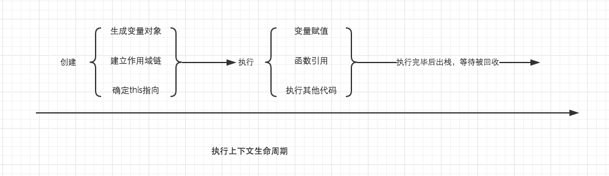

# 执行上下文 Execution Context

当控制器转到可执行代码时，就会进入一个执行上下文，形成一个作用域。

- 全局环境 首次运行时会进入该环境
- 函数环境 函数被调用时，会进入当前函数中执行代码
- eval 可执行 JS 代码

  - 栈底永远是全局上下文
  - 栈顶是正在执行的上下文

```javascript
var color = "blue";

function changeColor() {
  var anotherColor = "red";

  function swapColors() {
    var tempColor = anotherColor;
    anotherColor = color;
    color = tempColor;
  }

  swapColors();
}

changeColor();
```

- 执行顺序

  

---

# 变量对象

- ## 执行上下文的生命周期

  - 创建阶段 == 创建变量对象 >> 建立作用域 >> 确认 this 指向
  - 代码执行阶段 == 创建成功后 >> 开始执行代码 >> 变量赋值 >> 函数引用

  

- ## 变量对象 Variable Object

  变量对象的创建依次经历以下几个过程

  1. 建立 arguments 对象：检查当前上下文中的参数，建立该对象下的属性与属性值 (函数参数)
  2. 检查当前上下文的函数声明（使用 function 关键字声明的函数）。在变量对象中以函数名建立一个属性，属性值指向该函数所在的内存地址
  3. 检查当前上下文中的变量声明，在变量对象中以变量名建立一个属性，属性值为 undefined （如变量和函数同名，优先函数值）

  

- ## 变量提升
  - 函数及变量的声明将被提升到函数最顶部
  - 变量可以在使用后生声明，也就是变量可以先使用在声明
  - 函数声明优先级高于变量声明的优先级，并且函数声明和函数定义部分一起被提升

---

> 参见

- [执行上下文详细图解](https://blog.csdn.net/fedlover/article/details/103348419)
