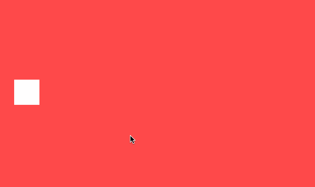
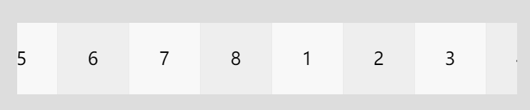

## Anime.js

---

- Anime.js (/ˈæn.ə.meɪ/) 是一个轻量的 JavaScript 动画库， 拥有简单而强大的 API。
- 可对 CSS 属性、 SVG、 DOM 和 JavaScript 对象进行动画。

> 例子 1



```javascript
import React, { useState, useRef, useEffect } from "react";
import anime from "animejs";
import styles from "./style.less";

export default function AnimateDemo() {
  const [anime01, setAnime01] = useState(false);
  const [anime02, setAnime02] = useState(false);
  const element = useRef();

  useEffect(() => {
    anime01 && !anime02 && animate01();
    anime02 && !anime01 && animate02();

    return () => {
      console.log("xxx");
    };
  }, [anime01, anime02]);

  function animate01() {
    if (element) {
      anime({
        targets: element.current,
        translateX: 400,
        duration: 2000,
        easing: "easeInOutExpo",
        backgroundColor: "#333",
        borderRadius: ["0%", "50%"],
        complete: () => {
          setAnime01(false);
        },
      });
    }
  }

  function animate02() {
    if (element) {
      anime({
        targets: element.current,
        translateX: 0,
        backgroundColor: "#FFF",
        borderRadius: ["50%", "0%"],
        easing: "easeInOutQuad",
        complete: () => {
          setAnime02(false);
        },
      });
    }
  }

  function clickHandler() {
    setAnime01(true);
    setTimeout(setAnime02.bind(null, true), 1000);
  }

  return (
    <div className={styles["container"]} onClick={clickHandler}>
      <div className={styles["el"]} ref={element} />
    </div>
  );
}
```

```less
.container {
  width: 600px;
  height: 400px;
  margin: 0 auto;
  background-color: #ff4b4b;
  padding-left: 30px;
  display: flex;
  align-items: center;

  .el {
    background: #fff;
    width: 50px;
    height: 50px;
    display: flex;
    justify-content: center;
    align-items: center;
    font-weight: bold;
    color: #ff4b4b;
  }
}
```

> 例子 2



```javascript
import React, { useEffect } from "react";
import anime from "animejs";
import styles from "./style.less";

export default function AnimateDemo() {
  useEffect(() => {
    let xTrans = [];
    anime.set(`.${styles["box"]}`, {
      translateX: function (el, i, l) {
        xTrans[i] = { x: i * -100 };
        return i * -100;
      },
    });

    anime({
      targets: xTrans,
      duration: 6000, //走一周持续时间
      easing: "linear",
      x: "+=800",
      loop: true,
      update: function (anim) {
        anime.set(`.${styles["box"]}`, {
          translateX: function (el, i, l) {
            return xTrans[i].x % 800;
          },
        });
      },
    });
  }, []);

  return (
    <div className={styles["zoumadeng"]}>
      <div className={styles["wrapper"]}>
        <div className={styles["boxes"]}>
          <div className={styles["box"]}>1</div>
          <div className={styles["box"]}>2</div>
          <div className={styles["box"]}>3</div>
          <div className={styles["box"]}>4</div>
          <div className={styles["box"]}>5</div>
          <div className={styles["box"]}>6</div>
          <div className={styles["box"]}>7</div>
          <div className={styles["box"]}>8</div>
        </div>
      </div>
    </div>
  );
}
```

```less
.zoumadeng {
  .wrapper {
    width: 700px;
    height: 100px;
    position: relative;
    margin: 40px auto 0;
    background: #ccc;
    overflow: hidden;
    .boxes {
      position: relative;
      left: -100px;
      .box {
        width: 100px;
        height: 100px;
        position: absolute;
        background: red;
        font-size: 25px;
        line-height: 100px;
        text-align: center;
      }
      .box:nth-child(odd) {
        background: #f8f8f8;
      }
      .box:nth-child(even) {
        background: #eee;
      }
    }
  }
}
```

> 参见

- [Github](https://github.com/juliangarnier/anime)
- [官网](https://www.animejs.cn/)
- Demo
    * [CodePen demos and examples](http://codepen.io/collection/b392d3a52d6abf5b8d9fda4e4cab61ab/)
    * [juliangarnier.com](http://juliangarnier.com)
    * [animejs.com](https://animejs.com)
    * [Moving letters](http://tobiasahlin.com/moving-letters/) by [@tobiasahlin](https://twitter.com/tobiasahlin)
    * [Gradient topography animation](https://tympanus.net/Development/GradientTopographyAnimation/) by [@crnacura](https://twitter.com/crnacura)
    * [Organic shape animations](https://tympanus.net/Development/OrganicShapeAnimations/) by [@crnacura](https://twitter.com/crnacura)
    * [Pieces slider](https://tympanus.net/Tutorials/PiecesSlider/) by [@lmgonzalves](https://twitter.com/lmgonzalves)
    * [Staggering animations](https://codepen.io/juliangarnier/pen/4fe31bbe8579a256e828cd4d48c86182?editors=0100)
    * [Easings animations](https://codepen.io/juliangarnier/pen/444ed909fd5de38e3a77cc6e95fc1884)
    * [Sphere animation](https://codepen.io/juliangarnier/pen/b3bb8ca599ad0f9d00dd044e56cbdea5?editors=0010)
    * [Layered animations](https://codepen.io/juliangarnier/pen/6ca836535cbea42157d1b8d56d00be84?editors=0010)
    * [anime.js logo animation](https://codepen.io/juliangarnier/pen/d43e8ec355c30871cbe775193255d6f6?editors=0010)