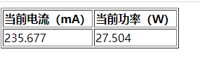

> 前置信息

《穿越火线》是一款"挖矿"游戏。

而我恰巧有一台闲置的低配电脑，能成为"无尽矿场"的小矿主

为此购买了一个向日葵插座，用来查看用电量和重启蓝屏的电脑

`利用javascript实现对电脑状态监控，并发送预警邮件和手机短信`

  

> 遇到的问题

"挖矿"过程中会出现网络抖动，游戏就会`掉线`。

需要一个`监视预警`"系统"，来给我抛出异常

  

> 解决方案

 

> > 方案

解决方案我有想过很多种

比如在 PC 端运行一个软件

监控电脑是否有操作,或者画面是否有变化

分析下来，目前而言`可行性太低`，限制太多

这个过程越简单越好

 

> > 向日葵硬件

向日葵插座通过 WIFI 上报当前用电信息

通过抓包可以取得电流、功率等一些信息

经测试：这些接口都没加密、支持跨域

由此我可以利用 javascript 实现一个简易版本的监控

 

> > 设想逻辑

抓包所取得的向日葵接口中，有两个有用的信息

分别是`当前电流`和`当前功率`

我可以通过`轮询`监控电脑的`电流和功率的变化`，来知晓当前计算机的运行状态

当电流和功率大于或小于某个`设定的阈值`，则向我发送报警信息

业务逻辑需要根据具体情况调优

 

> > 观测接口

从接口中分别观测

- 待机状态
- 关机状态
- 开机状态
- 挖矿状态
- 掉线状态

根据观测和记录的数据分析后得到如下结论

挖矿时电流和功率是最高的

- 电流处于 `180mA(毫安)` 以上
- 功率处于 `23W(瓦)` 以上

 

> > 快速迭代

为了方便和快速开发

该"预计系统"是通过 HTML 和 javascript 编写

通过 jquery 的 AJAX 发送请求获取当前用电信息

HTML 展示当前的电流和功率

当电流和功率低于阈值时，发送邮件预警

 

> > 邮件预警

在网上调研到可以通过第三方 SMTP 服务，完成发送邮件的动作

- [EmailJS](https://www.emailjs.com/docs/)

- [SMTPJS](https://www.smtpjs.com/)
  - [SmtpJS 发送邮件教程](https://blog.csdn.net/qq_45034708/article/details/106600049)

通过 JS 库完成邮件服务

 

> > 短信通知

移动 139 邮箱可设置免费短信通知

当有一封新邮件时，移动会发送短信给绑定邮件手机号

  

> 最后

至此，本地运行一个网页

通过多个第三服务完成对电脑的监控

监控服务可以是多样的，如 Java，Node

但 Javascript 是最方便最快速的

  

> 姊妹篇

- [210407-云监控电脑](https://hz-cool.github.io/Notes/%E5%A5%87%E6%80%9D%E5%A6%99%E6%83%B3/210407-%E4%BA%91%E7%9B%91%E6%8E%A7%E7%94%B5%E8%84%91)
